# Preparation and starting survey

I continued from Step 2 because I had already completed the Step 1 training in the previous assignment. I downloaded the supplied QSF and imported it as a new Qualtrics survey. The browser saved it as `Social_Media_Opinion_Leader-Experimental_Design(1).qsf`; its contents were not changed before import. I reviewed the current Canvas assignment, the complete Step 5 task document, the complete Step 6 documentation document, and the linked Qualtrics import, Randomizer, and Piped Text documentation. I reviewed the professor's demonstration transcript for 00:20–35:44 and visually skimmed the randomization and carry-forward demonstrations.

The current Canvas instructions require QMD and HTML files, so I followed those instructions rather than the older Word/Blackboard submission language in the attached documentation file.

Before editing, I inspected all nine blocks and the original Survey Flow. The source contained 36 active questions and 21 questions in Trash. Its flow showed both stimulus blocks sequentially, followed by DV. This would expose each participant to both conditions rather than create a between-subjects experiment. I retained the source blocks and existing timing questions, added one time-usage matrix, and left the Trash questions untouched.

| Original block | Purpose |
|---|---|
| Cover Page | Study introduction and participation consent |
| Overall Social Media Experience | Platform experience and behavior |
| External Information Source | Information sources, relatability, and influence |
| Opinion Leaders | Reliance, trust, advertising exposure, and attitudes |
| social_media_review | Product review stimulus and page timing |
| ads | Advertisement stimulus and page timing |
| DV | Shared evaluations of spokesperson, information, product, and behavioral intentions |
| Purchasing Behaivor | Purchase timing and recommendations |
| Demographics | Age, sex, and racial/ethnic identification |

**Source limitation:** the original review video is private and the original advertisement video is unavailable. I preserved both supplied embeds. I could verify routing to their pages and the subsequent questionnaire, but I could not verify actual video playback or exposure. The professor's demonstration also mentions that the old videos are unavailable. Working, approved stimuli would be needed before collecting experimental data.

# Task 1 – Project name

I renamed the imported project **Social Media Opinion Leader-Experimental Design**, as required. This is a separate project from my Module 1 survey. The project name is visible at the top of the Survey Flow and question-setting screenshots below.

# Task 2 – Understanding the experimental blocks

The two experimental conditions are a social media product review and an advertisement about Nike shoes. The review and advertisement blocks each include introductory instructions, a video page, and a Timing question. The shared DV block contains four questions measuring spokesperson evaluation, evaluation of information, product attitudes, and purchase/sharing intentions.

Each participant should receive one stimulus, followed by the same DV questions. Keeping DV outside both branches avoids duplicating the outcome questions and makes the two groups comparable on what they are asked afterward.

# Task 3 – Random assignment and Branch Logic

I inserted a Randomizer immediately after the original `id` Embedded Data element. It presents **1** of two Embedded Data elements and has **Evenly Present Elements** checked:

- `Ad Type = reviewer`
- `Ad Type = ads`

The assignment occurs before the cover page, while the stimulus is shown later after the common background questions. The reviewer branch contains only `social_media_review`. The ads branch contains only `ads`. The DV, purchasing, and demographic blocks remain outside the branches and follow them in that order.

Random assignment makes the groups comparable on average; it does not guarantee exact matching of every characteristic in a small sample. The balancing option supports approximately equal condition allocation. The preview tests establish that both routes work, rather than estimating population balance from a few tests.

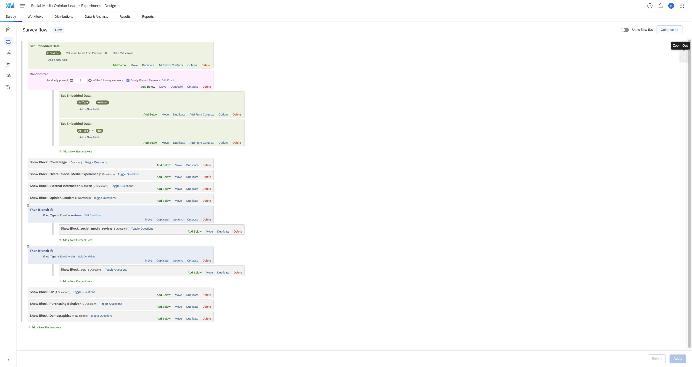{#fig-flow width=100%}

The complete flow in @fig-flow shows the relationship between the new elements and every original block. The shared DV block appears once, below both branches.

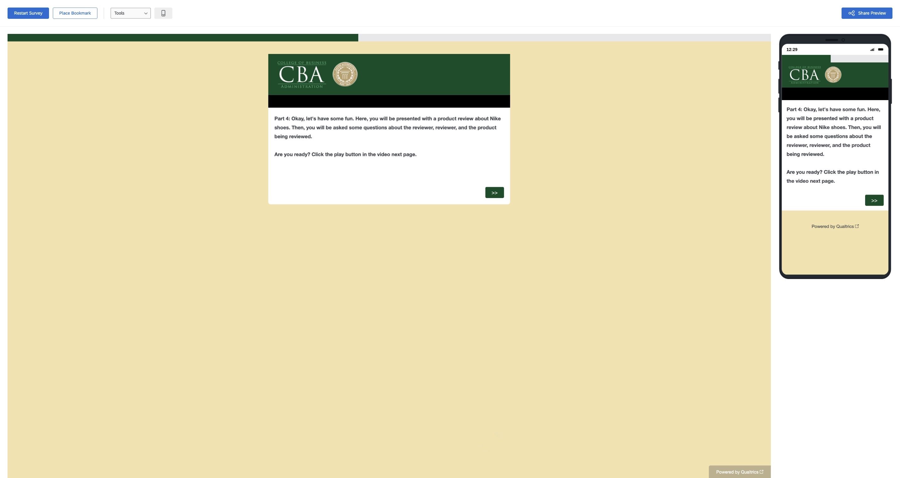{#fig-review-path width=100%}

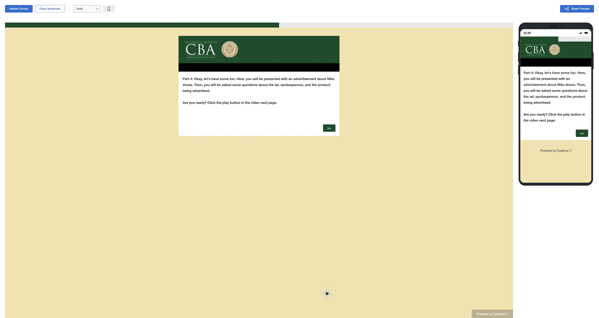{#fig-ads-path width=100%}

{#fig-dv-review width=100%}

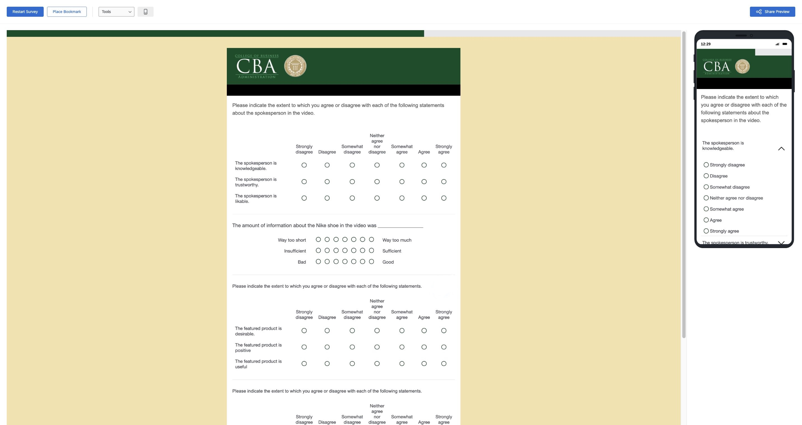{#fig-dv-ads width=100%}

# Task 4 – Separate usage rates for selected platforms

The original Q2.2 measured total social media time, which did not identify time spent on each platform. I changed it to: **“Which social media platforms do you use? Select all that apply.”** The answer setting is **Allow multiple answers**. Choices include Facebook, Instagram, Twitter / X, Snapchat, YouTube, TikTok, LinkedIn, and Other with a write-in field.

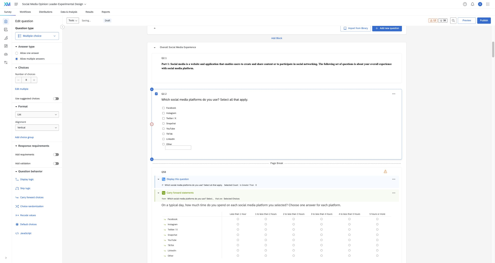{#fig-platforms width=100%}

I placed Q58 immediately afterward, with a page break so the selected choices are available to the next page. Q58 is a matrix with one answer per platform. Its statements use **Carry Forward → Q2.2 → Selected Choices – Entered Text**. This carries only selected platforms and uses the name entered for Other. The time categories run from less than one hour through five hours or more, with clear boundaries.

I also added a display condition: **Q2.2 Selected Count Is Greater Than 0**. This hides the matrix when someone leaves the optional platform question blank, rather than displaying an empty table. This condition supports the carry-forward question and does not change experimental assignment.

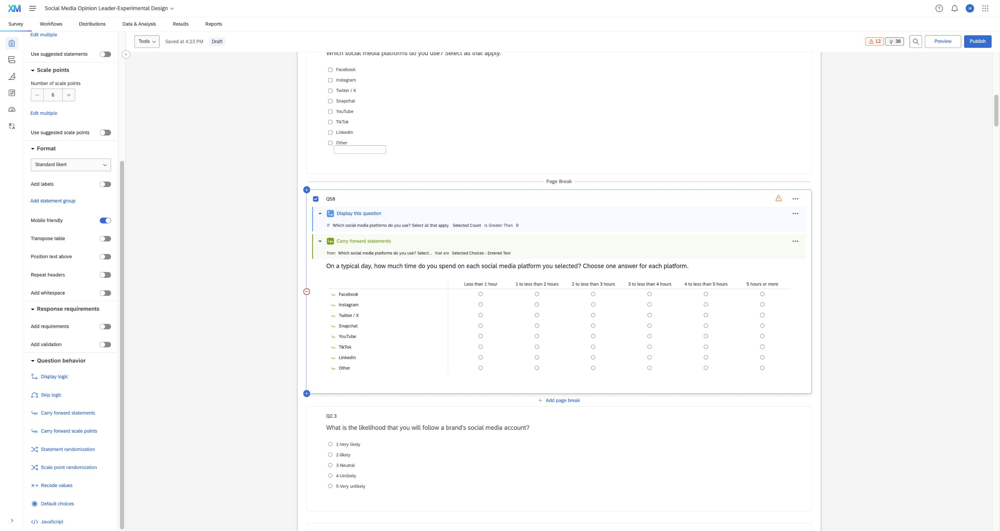{#fig-matrix width=100%}

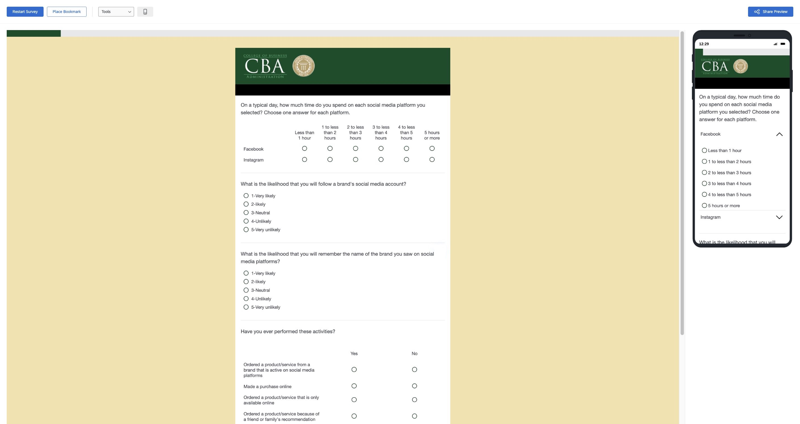{#fig-platform-test width=100%}

{#fig-other-test width=100%}

This follows the preferred Carry Forward method in the documentation. A separate series of piped-text questions is unnecessary because the assignment requires only one effective method. The write-in text is carried into the matrix instead of asking participants to type it again.

# Task 5 – Three additional questionnaire improvements

## Fully labeled reliance scale

In Q4.2, the original scale labeled only “1 – A lot” and “5 – Not at all”; the middle points were just numbers. I labeled every point: A lot, Quite a bit, A moderate amount, A little, and Not at all. I kept the original high-to-low direction and clarified the question wording. This gives respondents a shared meaning for the middle categories instead of requiring them to infer it.

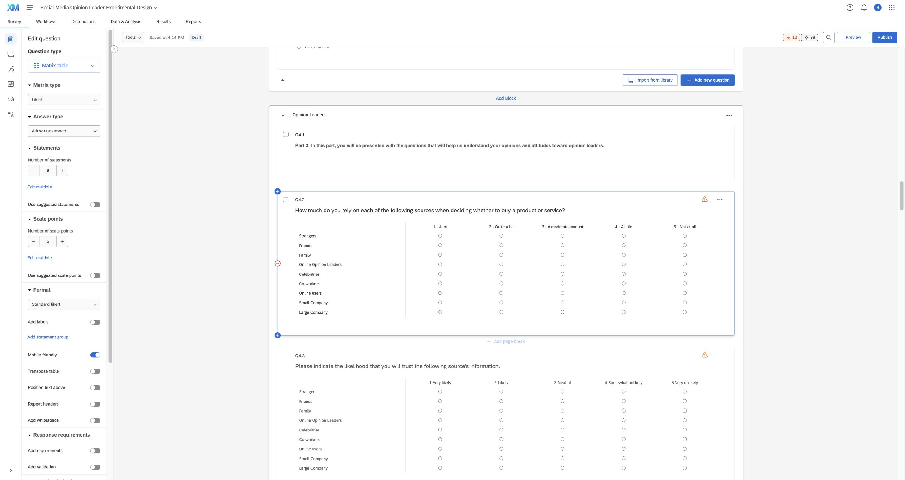{#fig-scale width=100%}

## Nonoverlapping purchase time ranges

Q8.2 originally used nested options such as “Within 24 hours,” “Within 48 hours,” and “Within a week.” A purchase within 24 hours could fit all three. I changed the options to separate intervals and added “More than 1 year” and an option for respondents who would not buy because of traditional advertising. The revised prompt asks about a typical purchase delay and specifies one answer. These changes reduce category overlap and avoid forcing nonbuyers into a purchase interval.

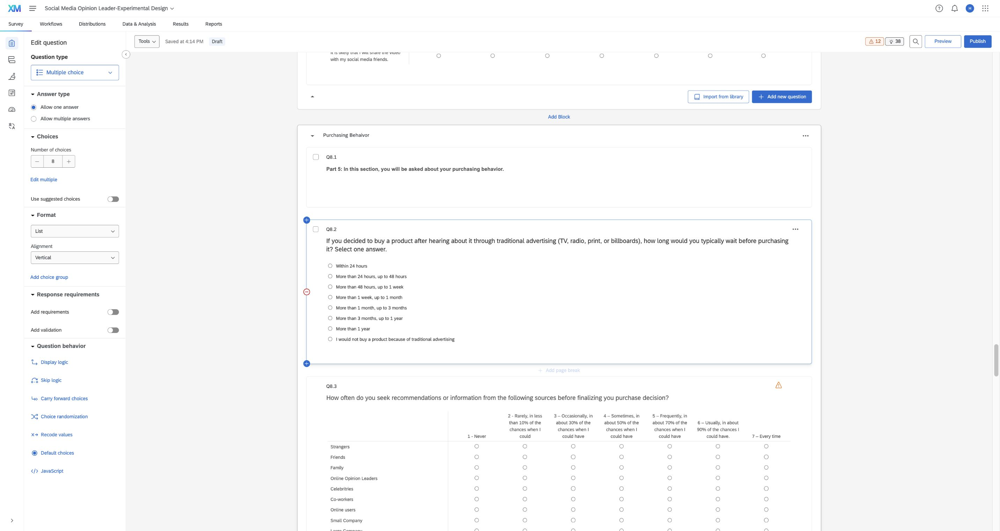{#fig-timeframe width=100%}

## Optional multiple-selection racial/ethnic identification

Q9.4 originally asked “What is you Ethnicity?” and permitted only one answer. I revised the wording to **“Which racial or ethnic groups do you identify with? Select all that apply. You may leave this question unanswered.”** I enabled multiple answers and kept the question optional. Participants who identify with more than one group can now represent that without being forced to choose one.

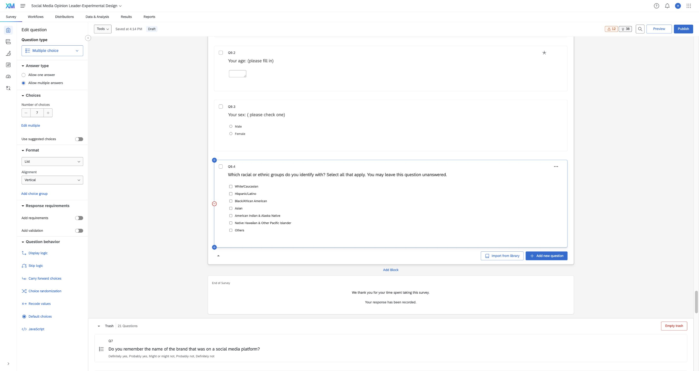{#fig-demographics width=100%}

## Additional completion correction

The imported survey ended with a redirect to an old study-credit system. I replaced that inherited redirect with the default Qualtrics thank-you message so this class exercise does not send preview participants to a different study. The existing no-consent skip to End of Survey was retained and tested.

# Preview verification and final checks

All test answers were entered in Preview mode to check programming; they are not research findings. I tested multiple independent starts and observed both the review and advertisement conditions. I verified the full review path through completion and both stimulus-to-DV transitions.

| Test | Observed result |
|---|---|
| Review assignment | Review introduction and review video page appeared; advertisement block was skipped; common DV followed. |
| Advertisement assignment | Advertisement introduction and advertisement video page appeared; review block was skipped; common DV followed. |
| Facebook + Instagram | Exactly two matrix rows; independent time answers could be selected. |
| Facebook + Other = Reddit | Facebook and Reddit appeared as separate rows; no second write-in field was needed. |
| No platform selected | After adding the display condition, the time matrix was hidden and the next common questions appeared. |
| No consent | Survey ended immediately, without showing the questionnaire. |
| Multiple racial/ethnic groups | Two groups could be selected, and navigation continued. |
| Full review path | DV, purchasing, demographics, and default completion appeared in order. |
| Video playback | Could not be verified: original review video private; original advertisement unavailable. |

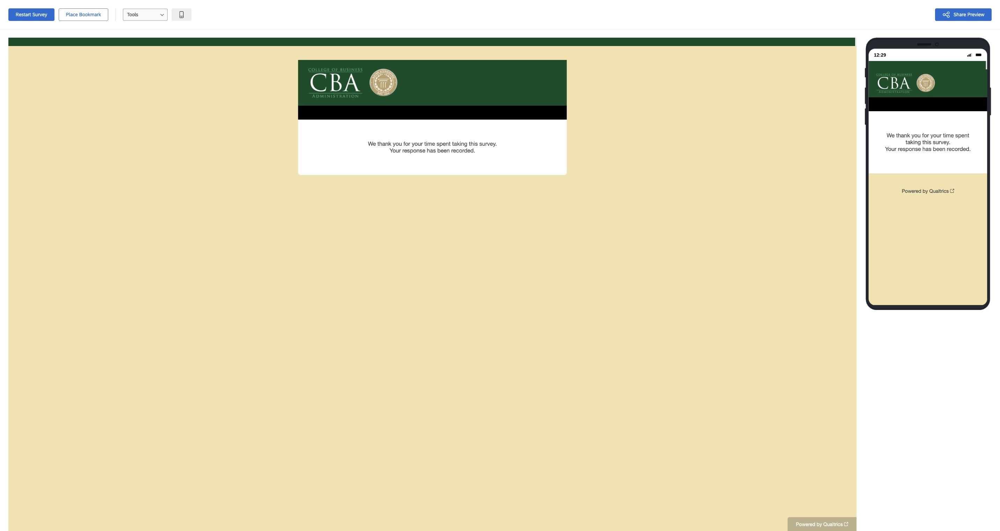{#fig-completion width=100%}

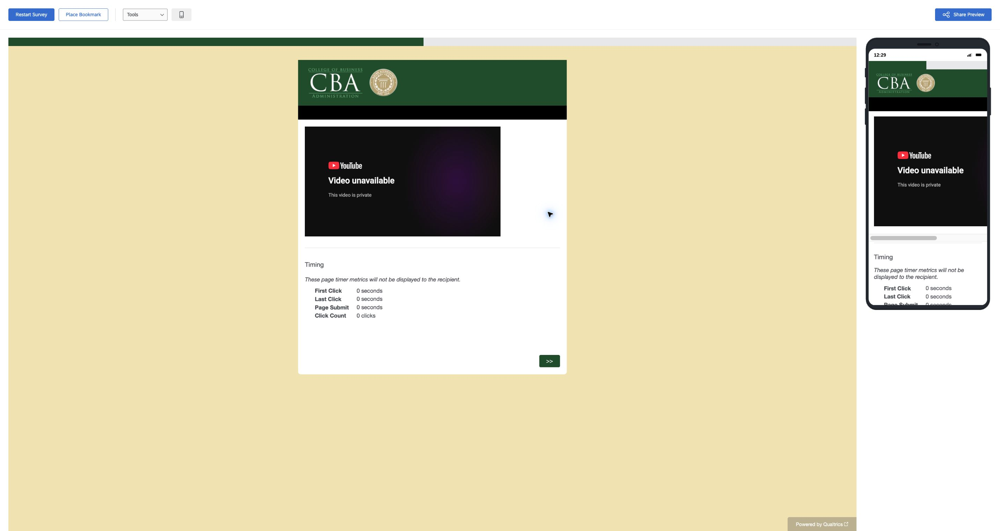{#fig-review-unavailable width=100%}

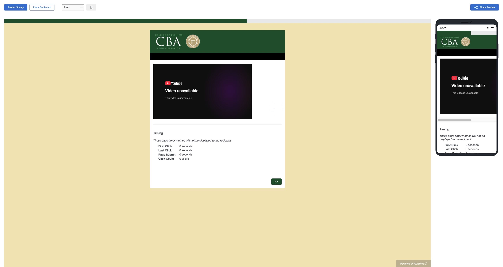{#fig-ads-unavailable width=100%}

I compared the final programming and this report with the Canvas page and both instruction documents. The report includes the complete Survey Flow, platform answer settings, the carry-forward configuration, three distinct improvements, and preview evidence. The survey remains a draft for this programming exercise. No professor was invited as a collaborator, and nothing was submitted to Canvas.

The required programming is complete. Actual stimulus playback remains unavailable in the supplied source, so the survey is not ready for real experimental data collection until approved working videos are provided.

# Appendix

- [GitHub Repository](https://github.com/hanamai111/Qualtrics-M02-Experimental-Design)
- [Published HTML Report](https://hanamai111.github.io/Qualtrics-M02-Experimental-Design/Mai-Han-Qualtrics-M02-Experimental-Design.html)
